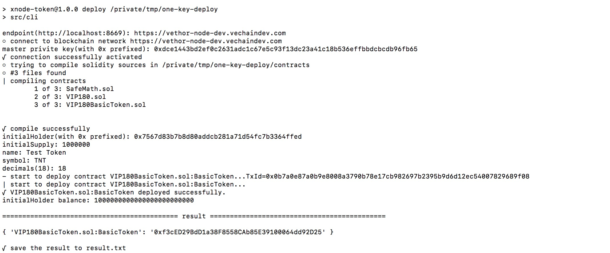

VIP180 All-in-One Deployment Tool - command line version
====

This is a command line based and one-click type of application that is used to generate and deploy a standard BIP180 token smart contract. VeChain Comet wallet is required to run this application.

There are options to run this tool at the moment.

1. Run the application in your local environment
2. Run the application on Morpheus Labs BPaaS (ML BPaaS)

Option 1 - Run the application in your local environment. In this case, all the required software need to be installed first, such as source code editor (e.g. VSCode), node.js, npm, truffle. This option may be useful, if the user just want to run the appliation to deploy the token smart contracts and not interested in knowing the details of the application, and provided the user is willing to setup a local environment to run the application.

Option 2 - Run the application on ML BPaaS - In this case, all the required software are pre-installed. You can explore and test the application using VeChain Solo node on the platform with all ready-to-use tools and network nodes, or test on VeChain testnet before you run the application to deploy the token smart contracts to the VeChain mainnet. This option is recommended, if users want to know about the application or even want to customize the application.

The following are the general steps to run the application.

# Install

	npm install

# Usage

	npm run deploy

+ endpoint: The HTTP provider for VeChainThor network
+ master private key: The signer to deploy the contract
+ initialHolder: The initial VIP180 token holders
+ name: The name of token
+ symbol: The symbol of token
+ decimals: The number of decimals the token uses 

And the specific steps to run the application on the ML BPaaS are:

# Screenshot

